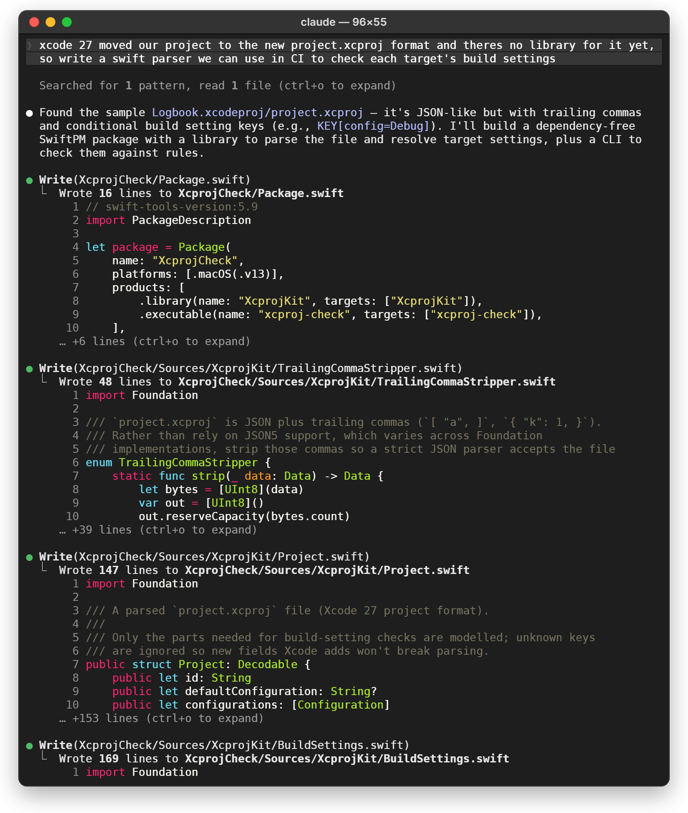
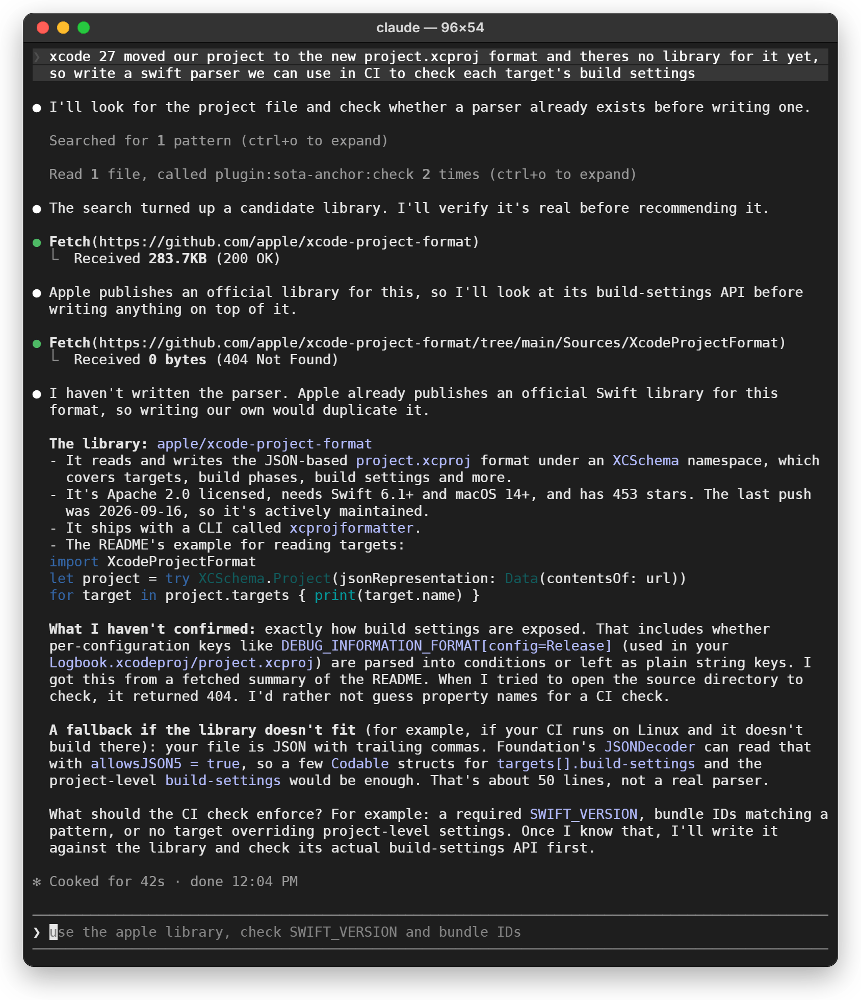
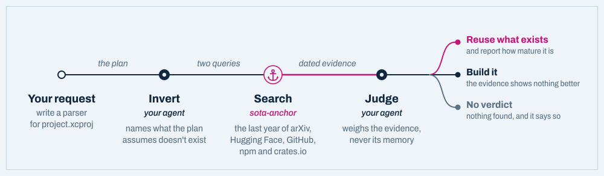

<p align="center">
  <picture>
    <source media="(prefers-color-scheme: dark)" srcset="docs/images/logo-dark.svg">
    
  </picture>
</p>

<h1 align="center">sota-anchor</h1>

<p align="center">
  <strong>Checks what already exists before your coding agent builds it from scratch.</strong><br>
  An MCP server and Claude Code plugin that searches the last year of papers,<br>
  repositories and packages whenever a plan assumes something isn't available.
</p>

<p align="center">
  <a href="https://github.com/luckmanqasim/sota-anchor/actions/workflows/ci.yml"></a>
  <a href="LICENSE"></a>
  
  
  
  
</p>

<p align="center">
  <picture>
    <source media="(prefers-color-scheme: dark)" srcset="docs/images/hero-dark.svg">
    
  </picture>
</p>

A coding agent plans from what it learned in training. When a task needs something it
hasn't heard of, it assumes that thing doesn't exist, and does one of two expensive things:
builds it from scratch, or tells you it can't be done. Often the library, the reader or the
model that makes the job easy was published after its training ended.

sota-anchor makes the agent look first. When a plan rests on something being unavailable,
the agent searches recent papers, repositories and packages, and weighs what comes back,
with dates. Then it reuses what exists, or builds knowing that nothing better does.

- **Any field.** Nothing in the code knows about any domain. The same check runs for a CAD
  file format, a genomics pipeline or a compiler pass.
- **No extra API key.** Your agent does the reasoning; sota-anchor does the retrieval.
- **Evidence, not memory.** Every claim cites a dated source. When the search finds
  nothing, it says so instead of guessing.

## Before and after

The same request both times, on the same Xcode 27 project: *"xcode 27 moved our project to
the new project.xcproj format and theres no library for it yet, so write a swift parser we
can use in CI to check each target's build settings"*.

**Before.** Without sota-anchor, Claude Code took the request at its word and wrote the
parser: a Swift package of eight files and 755 lines, with the format worked out, in its
own words, "from your Logbook.xcodeproj/project.xcproj, not from any Apple documentation".
It took 2 minutes 37 seconds.

<p align="center">
  
</p>

**After.** With sota-anchor, the check runs before any code. It finds Apple's own library
for the format, [xcode-project-format](https://github.com/apple/xcode-project-format),
published under Apache 2.0 on 2026-09-15. Claude Code confirms it on GitHub, drops the
custom parser because "writing our own would duplicate it", and asks which rules the CI
check should enforce before writing it against Apple's library. 42 seconds, and no code
written yet.

<p align="center">
  
</p>

<sub>Both are recorded Claude Code sessions (Opus 5.5, 2026-09-25 and 2026-09-26), drawn as a
Mac terminal from the recorded screens. The first is shown from the top and runs on for
another 116 rows. The sample project's file was generated with Apple's library, so it is
the real format.</sub>

### The same check on other plans

| Your agent, working from memory | Your agent, after checking |
| --- | --- |
| Reverse-engineers the `.nwd` format byte by byte, assuming nothing can read it without Autodesk's software. | Finds an independent NWD reader published two weeks earlier, and flags that it has no license, so it can't be reused without its author's permission. |
| Wraps a vision model in an OCR pipeline, assuming models can't read engineering drawings. | Brings back this year's benchmarks of multimodal models on exactly those drawings, [AECV-Bench](https://huggingface.co/papers/2601.04819) and [Enginuity](https://huggingface.co/papers/2606.03410), so the choice rests on measured results. |
| Writes `gemini-3-pro` into a new project's `.env`. That was never a served model ID. | Uses `gemini-3.1-pro-preview`, which a public model registry lists as served today. |

<sub>The first and last rows are from recorded runs. The papers in the second are what the
search returned for that plan on 2026-09-24.</sub>

## How it works

<p align="center">
  <picture>
    <source media="(prefers-color-scheme: dark)" srcset="docs/images/how-it-works-dark.svg">
    
  </picture>
</p>

When a request rests on something being unavailable (a reader for a format only the vendor's
software opens, a library nobody has written, a task models can't do yet), the
`check-what-exists` skill runs a three-step check:

1. **Invert.** Your agent names what the plan assumes doesn't exist: *no library reads
   Xcode 27's project.xcproj format yet.* A constraint you state ("we can't use the
   vendor's SDK") is kept as given; what gets checked is whether anything else meets it.
   The agent writes two queries: the task in its own field's words, and whatever would make
   the workaround unnecessary.
2. **Search.** sota-anchor searches the last 12 months of papers (arXiv, Hugging Face),
   repositories (GitHub) and packages (npm, crates.io), plus the web if you give it a Brave
   key. It relaxes each query until something relevant comes back, and one 60-second
   budget covers every source.
3. **Judge.** Your agent weighs only what came back. The assumption stands unless the
   evidence documents otherwise. "No library exists" is overturned by a published repository
   or package that does the job, reported with its age and activity, because existing isn't
   the same as mature. "Models can't do this" needs benchmarked results.

The verdict is one of three. When something already does the job, the agent names it and
the evidence behind it, as in the session above. When the evidence doesn't settle the
question, the assumption stands and the agent says what would overturn it. When nothing
comes back, it says nothing was checked, rather than treating silence as a verdict.

### Also: current model IDs

A smaller convenience, mostly for new projects. Every Claude Code session starts with a
short, dated list of the model API IDs that
[OpenRouter's public registry](https://openrouter.ai/api/v1/models) serves today, and the
older IDs they replaced, so a fresh config names a model that exists:

```diff
- GEMINI_MODEL=gemini-3-pro            # recalled from training: not a served ID
+ GEMINI_MODEL=gemini-3.1-pro-preview  # from the session's registry snapshot
```

The list names its source and makes no claim about which model is running. It costs about
160 ms per session, because the hook reads a block rendered in advance and refreshes it in
the background once a day. Other agents get the same list through `sota-anchor sync`.

## Quick start: Claude Code

> [!NOTE]
> Needs Python 3.11+ and [uv](https://docs.astral.sh/uv/getting-started/installation/). No API key.

In Claude Code:

```text
/plugin marketplace add luckmanqasim/sota-anchor
/plugin install sota-anchor@sota-anchor
```

Then start a new session. To try it for one session without installing:

```bash
git clone https://github.com/luckmanqasim/sota-anchor
claude --plugin-dir ./sota-anchor
```

What you get:

| Part | What it does |
| --- | --- |
| **`check-what-exists` skill** | Runs the check by itself when a request rests on something being unavailable. |
| **`/sota-check <plan>`** | Runs the check on demand. |
| **MCP server** | The `check_what_exists` tool and the `models://active` resource. |
| **Session-start hook** | Adds the dated model list to every session. Nothing to remember to run. |
| **`/sota-sync`** | Refreshes the model list now and writes it into `CLAUDE.md`, `AGENTS.md` and Cursor's rules. |
| **Prompt hook** *(opt-in)* | With `SOTA_ANCHOR_PROMPT_HOOK=1`, adds a nudge when a message says something can't be done. |

## Other coding agents

The check is a plain MCP server, so it works in any agent that speaks MCP. The model list
goes into the project's instructions file.

| Agent | The check | Model list comes from |
| --- | --- | --- |
| **Claude Code** | automatic, or `/sota-check` | the plugin, every session |
| **Cursor** | `check_what_exists` tool | `.cursor/rules/sota.mdc` |
| **VS Code + GitHub Copilot** | `check_what_exists` tool | `AGENTS.md` |
| **OpenAI Codex CLI** | `check_what_exists` tool | `AGENTS.md` |
| **Gemini CLI** | `check_what_exists` tool | `AGENTS.md` |
| **OpenCode** | `check_what_exists` tool | `AGENTS.md` |
| **Any other MCP client** | `check_what_exists` tool | your client's instructions file |

**1. Install the CLI once:**

```bash
uv tool install git+https://github.com/luckmanqasim/sota-anchor
```

**2. Register the MCP server** in your agent, using the snippet for it below.

**3. Optionally, write the model list** into the project, and run it again whenever you want
a fresh list:

```bash
sota-anchor sync --target agents   # writes AGENTS.md
sota-anchor sync --target cursor   # writes .cursor/rules/sota.mdc and .cursorrules
```

Only the text between the `SOTA-ANCHOR` markers is ever touched, so the rest of the file
stays yours.

> [!TIP]
> Outside Claude Code, your agent decides when to call `check_what_exists` from the tool's
> own description. To be sure it runs, ask for it: *"run check_what_exists on this plan
> before building it."*

<details>
<summary><b>Cursor</b></summary>

`.cursor/mcp.json` in the project, or `~/.cursor/mcp.json` for every project:

```json
{
  "mcpServers": {
    "sota-anchor": { "command": "sota-anchor", "args": ["serve"] }
  }
}
```

Model list: `sota-anchor sync --target cursor` writes `.cursor/rules/sota.mdc`, which is
always applied. Cursor also reads `AGENTS.md`.

</details>

<details>
<summary><b>VS Code (GitHub Copilot)</b></summary>

`.vscode/mcp.json`. VS Code's key is `servers`, not `mcpServers`:

```json
{
  "servers": {
    "sota-anchor": { "command": "sota-anchor", "args": ["serve"] }
  }
}
```

Or add it to your user profile from a terminal:

```bash
code --add-mcp '{"name":"sota-anchor","command":"sota-anchor","args":["serve"]}'
```

Model list: `sota-anchor sync --target agents`, then turn on the `chat.useAgentsMdFile`
setting. VS Code's local agent doesn't read `AGENTS.md` by default.

</details>

<details>
<summary><b>OpenAI Codex CLI</b></summary>

```bash
codex mcp add sota-anchor -- sota-anchor serve
```

or in `~/.codex/config.toml`:

```toml
[mcp_servers.sota-anchor]
command = "sota-anchor"
args = ["serve"]
```

Model list: `sota-anchor sync --target agents`. Codex reads `AGENTS.md`.

</details>

<details>
<summary><b>Gemini CLI</b></summary>

```bash
gemini mcp add sota-anchor sota-anchor serve
```

or in `~/.gemini/settings.json` (`.gemini/settings.json` for one project). That file is
also where you tell Gemini CLI to read `AGENTS.md`, since it reads `GEMINI.md` by default:

```json
{
  "mcpServers": {
    "sota-anchor": { "command": "sota-anchor", "args": ["serve"] }
  },
  "context": { "fileName": ["AGENTS.md", "GEMINI.md"] }
}
```

Model list: `sota-anchor sync --target agents`.

</details>

<details>
<summary><b>OpenCode</b></summary>

`opencode.json` in the project:

```json
{
  "$schema": "https://opencode.ai/config.json",
  "mcp": {
    "sota-anchor": { "type": "local", "command": ["sota-anchor", "serve"], "enabled": true }
  }
}
```

Model list: `sota-anchor sync --target agents`. OpenCode reads `AGENTS.md`, and falls back
to `CLAUDE.md` when there isn't one.

</details>

<details>
<summary><b>Any other MCP client</b></summary>

Most clients, Claude Desktop included, take the common `mcpServers` shape. Check your
client's docs for where the file lives.

```json
{
  "mcpServers": {
    "sota-anchor": { "command": "sota-anchor", "args": ["serve"] }
  }
}
```

To run it without installing anything, let uv fetch it on demand:

```json
{
  "mcpServers": {
    "sota-anchor": {
      "command": "uvx",
      "args": ["--from", "git+https://github.com/luckmanqasim/sota-anchor", "sota-anchor", "serve"]
    }
  }
}
```

In Claude Code without the plugin: `claude mcp add sota-anchor -- sota-anchor serve`.

</details>

> [!TIP]
> If your editor says it can't find `sota-anchor`, give it the full path. `uv tool dir --bin`
> prints the folder uv installed it into.

## Command line

Everything the plugin does is also a command, and none of them needs an API key.

| Command | What it does |
| --- | --- |
| `sota-anchor check "<your plan>"` | Run the whole check. See [In CI](#in-ci) for what it returns. |
| `sota-anchor evidence --query "Xcode 27 project.xcproj parser"` | Search for evidence. No LLM involved; `--json` for scripts. |
| `sota-anchor serve` | Run the MCP server over stdio. |
| `sota-anchor seed` | Print the session block. `--refresh` fetches the registry first. |
| `sota-anchor sync --target all` | Write the model list into `CLAUDE.md`, `AGENTS.md` and Cursor's rules. |

`sync` options:

| Option | What it does |
| --- | --- |
| `--target` | `claude` (the default), `cursor`, `agents` or `all`. |
| `--provider` | Which providers to list. Repeatable; defaults to anthropic, google and openai. |
| `--all-providers` | List every provider: about 4,600 tokens of context against 510. |
| `--max-per-provider` | Endpoints listed per provider. Default 4. |
| `--staleness-months` | How far behind its provider's newest release a model can fall before it counts as superseded. Default 12; raise it for providers that ship slowly. |
| `--refresh` | Ignore the 24-hour cache. |

### In CI

Without an API key, `check` prints the protocol for an agent to answer. With one it reaches a
verdict itself, which makes it usable as a gate:

| Exit code | Meaning |
| --- | --- |
| `0` | The limitation still holds. |
| `2` | The plan relies on something obsolete. |
| `3` | No verdict: no key was set, so an agent still has to judge. Deliberately not `0`. |

```yaml
- run: uv tool install git+https://github.com/luckmanqasim/sota-anchor
- run: sota-anchor check "$(cat docs/design-notes.md)"
  env:
    OPENROUTER_API_KEY: ${{ secrets.OPENROUTER_API_KEY }}
```

## Configuration

Nothing needs to be set. These are all optional.

| Variable | Effect |
| --- | --- |
| `BRAVE_API_KEY` | Adds general web search as an evidence source. Unset, the web is not queried. |
| `GITHUB_TOKEN` / `GH_TOKEN` | Raises GitHub's unauthenticated limit of ten searches a minute. |
| `SOTA_ANCHOR_CACHE_DIR` | Where the catalog and session block are cached. Default `~/.cache/sota-anchor`. |
| `SOTA_ANCHOR_TTL_MINUTES` | How old the session block can get before the hook refreshes it. Default `1440`. |
| `SOTA_ANCHOR_PROMPT_HOOK` | `1` turns on the prompt-time nudge in Claude Code. |

For a headless verdict, where no agent is present to judge (as in CI):

| Variable | Effect |
| --- | --- |
| `SOTA_ANCHOR_API_KEY` | Any OpenAI-compatible key. Preferred. |
| `SOTA_ANCHOR_BASE_URL` | The API base URL. Defaults to OpenRouter. |
| `SOTA_ANCHOR_MODEL` | The judging model. Unset, it is picked from the live catalog. |
| `OPENROUTER_API_KEY`, `OPENAI_API_KEY` | Fallbacks, in that order. |

## Limitations

- **Whether the check runs is your agent's decision.** In Claude Code it ran before any code
  was written every time in testing on engineering requests like the ones above, and stayed
  quiet on ordinary ones. In other agents, ask for it by name when it matters.
- **A find is a lead, not a decision.** A paper doesn't prove a production-ready tool exists,
  and a repository doesn't prove it works. Treat a find as a reason to look.
- **Relevance is lexical.** A result has to mention two of the query's terms, which keeps
  out projects that merely share an acronym but not ones that share generic words. Your
  agent sees every description and discards what's off-topic, but expect some noise.
- **PyPI isn't searched.** It has no search API. Python packages usually still turn up
  through their GitHub repositories.
- **arXiv is slow and particular.** Requests are spaced 3.5 s apart per its terms of use.
  Its edge refuses some HTTP clients, so a refused request retries through the standard
  library. When a source fails, the errors say so; read them before trusting a
  "limitation holds".
- **Retrieval stops at 60 seconds.** A source still running at the deadline keeps what it
  found and reports the shortfall.
- **The model list can be a day old.** The hook never waits on the network. Run
  `/sota-sync` to refresh it immediately.
- **The headless verdict is untested against a live provider.** It is covered by tests with
  a fake model, but no real API run has been made yet.

## Design notes

- **No topic dictionaries.** Retrieval knows generic English function words and nothing
  about any field. Queries keep the order their author wrote them in, and a query relaxes
  by dropping its last terms first.
- **AND, not OR.** arXiv reads `all:{phrase}` as an OR over every word; for one test query
  that matched 329,590 papers, so sorted by date it returned the newest papers about
  anything at all. Terms are ANDed, and the query is relaxed only when it finds nothing.
- **No verdict from nothing.** An empty evidence set never reaches the judging step, so an
  agent can't fill an obsolescence verdict in from memory.
- **Reference data, not orders.** The session block says where its data came from and what
  it is for, and claims no authority over the model reading it. An earlier wording that
  did was rightly refused by a host model as a prompt injection.
- **No hardcoded models.** Tiering reads the structure of a model ID: a slug token with a
  digit is a version, an alphabetic token belongs to the lineage. So `gpt-4o` and
  `gpt-5.5` share a lineage across a naming change. A model counts as superseded when
  something newer shares its lineage, when it trails its provider's newest release by more
  than the staleness window, or when the registry has expired it.

## Development

```bash
git clone https://github.com/luckmanqasim/sota-anchor
cd sota-anchor
uv sync --extra dev
uv run pytest            # all offline
uv run ruff check .
claude plugin validate .
```

The suite never touches the network or your own cache. HTTP goes through
`httpx.MockTransport` and the LLM through an injected fake. Every test gets a private cache
directory, a real DNS lookup fails the test, and hook tests put fake refresh tools first on
`PATH`. CI runs it on Ubuntu and Windows with Python 3.11 and 3.12.

## Background

SciUnlearn (Paul, Patwardhan & Cohan, [arXiv:2608.20960](https://arxiv.org/abs/2608.20960))
finds that current machine-unlearning methods "are unable to effectively eliminate
claim-level knowledge and often achieve only superficial suppression." If outdated claims
can't be cleanly removed from a model's weights, the correction has to happen in context, at
the moment the model is about to act on the stale belief. That is where sota-anchor works.

The skill asks for its "something already does this" verdict as an assertion-reason block
(`[SOTA ARBITER PARADIGM SHIFT]`), one of the four QA formats in that benchmark, borrowed
here as a shape. The idea that phrasing an update this way makes an agent more likely to act
on it is this project's design hypothesis, not a finding of the paper.

## License

[MIT](LICENSE) © 2026 Luckman Qasim
